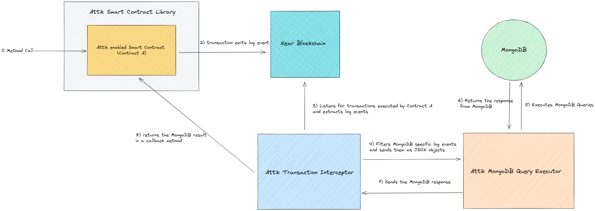

# NEARttik

Project concentrated on providing protocol that smart contracts would use to create MongoDB
databases, schemas and queries on the go without having to deal with Chainlink nodes and adapters.

## The project's architecture

### 1) Attik's Smart Contract Library (Attik SDK - JS)

- This library serves the purpose of providing Mongoose-like architecture,
containing methods and structures to interact with MongoDB in a seamless way;
- It is written with NEAR's JavaScript SDK and TypeScript;
- It provides methods like: createCollection, save, find, delete;
- It also provides functionality to combine a few queries and treat them as one transaction.

### 2) Example Contract

- Contract that uses **Attik Smart Contract Library** as its base;
- It shows how exactly would an Attik smart contract model look like (hint: the same as in Web2 NodeJS Mongoose code);
- Implements Coordinate(x, y) as model and defines basic CRUD operations.

### 3) Attik Transaction Interceptor

- **The transaction interceptor** looks for transactions executed by the Smart Contracts that 
are using **Attik's Smart Contract Library** in real-time, filters the logs in each transaction and
sends only mongo-query-related logs as queries to the **Attik MongoDB Query Executor**;
- Once **Attik MongoDB Query Executor** is ready with the execution of the queries, **the Transaction Interceptor**
calls the appropriate callbacks that were set in the initial queries in the Smart Contracts.
- It uses **NEAR Indexer** to track the flow of new transactions.

### 4) Attik MongoDB Query Executor

- **The MongoDB Query Executor** is taking all the queries that come from the **Transaction Interceptor**,
runs them in-order of arrival, then forwards the response back to Interceptor.
- Translates the JSON objects to MongoDB queries.

## Next steps

- Uploading backup versions of each MongoDB to IPFS as the first step towards decentralization;
- A protocol that is completely decentralized (perhaps a chain on Cosmos);
- Roadmap - TBD..

